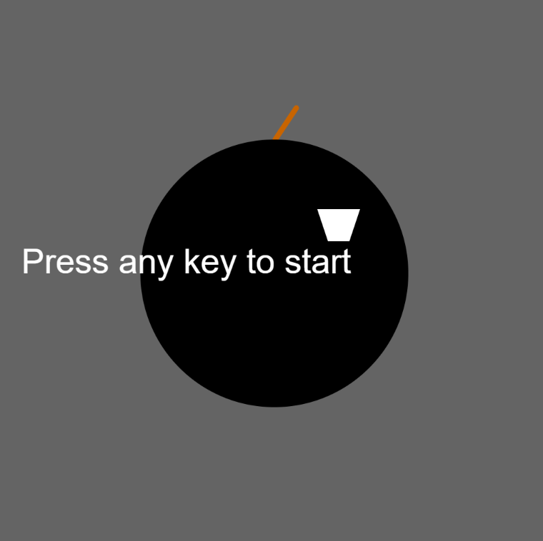

TRY THE GAME:  https://abidazainab.github.io/Defuse_Bomb_Game/

📸 Preview
A shaking bomb with a burning fuse. Countdown timer ticking. Can you diffuse it in time?

💣 Bomb Diffusion Game
A simple keyboard-based game built with p5.js, where you must diffuse a bomb by pressing a secret key sequence before the countdown reaches zero!

🎮 Gameplay Instructions
When you launch the game, you'll see a bomb on screen.

Press any key to start the countdown.

The bomb will start to shake, and a fuse will appear with a flame.

You must now diffuse the bomb before time runs out!

✅ How to Win
Press keys in the correct sequence:

First key: D

Second key: F

If both keys are entered correctly in order, you win!

🔥 Special Keys (Bonus Time)
These keys will give you extra time:

G

H

J

Each of these keys adds +20 to the countdown timer.

❌ How to Lose
If you press a wrong key (not in the sequence or not a bonus key), the bomb will explode, and it's Game Over.

If the timer reaches 0, the bomb also explodes.

🔁 Restarting the Game
After the game ends (win or lose), just press any key to restart.

👩‍💻 Author
Built using p5.js — a creative JavaScript library for visual and interactive experiences.

~ Abida Zainab
